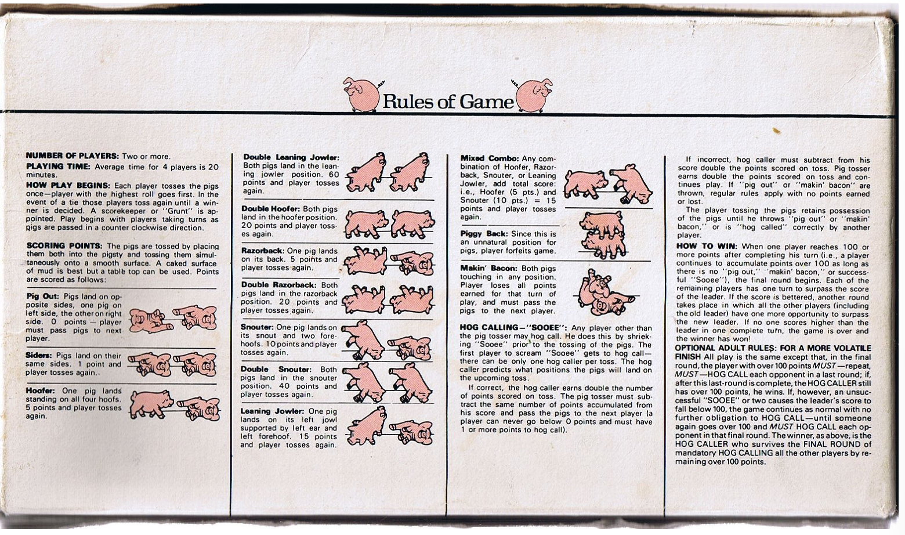

# Pass the Pigs - Sequential Variant

[](https://www.python.org/downloads/)
[](https://gymnasium.farama.org/)
[](https://www.pygame.org/news)
[](https://pytorch.org/)
[](https://www.tensorflow.org/tensorboard)

> **Sequential Variant Branch** - This branch features an enhanced game theory variant where agents can observe their opponent's last action and points scored, enabling more sophisticated strategic gameplay and adaptive learning.

## About the Game

Pass the Pigs is a version of the dice game Pig (created by David Moffatt in 1977) that uses asymmetrical throwing dice.

- **Goal**: Be the first player to reach 100 points
- **Gameplay**: Each turn, roll 2 model pigs and gain/lose points based on how they land
- **Strategy**: Choose to "bank" points or risk losing them on a bad roll
- **Sequential Variant**: See your opponent's last move and adapt your strategy accordingly!

### Rules


## Sequential Variant - Key Innovation

This branch implements a **Sequential (Stackelberg-like)** game variant that enhances strategic depth through information asymmetry:

### What Makes It Different?

**Standard Variant**:
- Players only see current scores
- No information about opponent's recent actions
- Observation space: `[own_score, opp_score, turn_score, hog_call]`

**Sequential Variant**:
- **See opponent's last action** (ROLL, PASS, HOG_CALL)
- **See opponent's last points scored** (including losses from oinkers/piggybacks)
- **Adapt strategy dynamically** based on opponent behavior
- Enhanced observation space: `[own_score, opp_score, turn_score, hog_call, opp_last_action, opp_last_points]`

### Strategic Implications

```python
# Example: Sequential agent can reason:
if opponent_last_points >= 10:
    # Opponent scored big! Be more aggressive to catch up
    threshold_adjust = -5

if opponent_last_action == PASS and opponent_last_points < 5:
    # Opponent played cautiously, I can be more conservative
    threshold_adjust = +5
```

This creates a **Stackelberg-like game** where:
- The second player has an information advantage (leader-follower dynamic)
- Agents can learn counter-strategies based on opponent patterns
- Q-tables become larger but encode richer strategic knowledge
- More realistic gameplay mirroring real-world competitive scenarios

### Comparison Table

| Feature | Standard | Sequential |
|---------|----------|------------|
| Observation dimensions | 4 (with hog calls) | 6 (with hog calls) |
| Q-table size | ~10^4 states | ~10^6 states |
| Information | Current scores only | + Opponent's last move |
| Learning complexity | Moderate | High |
| Strategic depth | Basic risk/reward | Adaptive counter-play |
| Real-world analogy | Blind bidding | Poker (with tells) |


### Scoring System

| Roll Result | Points | Description |
|-------------|---------|-------------|
| Double Trotter | 40 | Both pigs on side with legs showing |
| Double Snouter | 30 | Both pigs on snout |
| Double Razorback | 20 | Both pigs on back |
| Double Leaning Jowler | 20 | Both pigs leaning on side |
| Leaning Jowler | 15 | Single pig leaning on side |
| Snouter | 10 | Single pig on snout |
| Razorback | 5 | Single pig on back |
| Trotter | 5 | Single pig with legs showing |
| Sider | 1 | Single pig on side | roll again |
| Piggyback | 0 | One pig on top of another | lose turn |
| Pig Out | 0 | One pig on side, one on back | lose turn |
| Oinker | 0 | Both pigs on different sides | lose turn |


## stuff to modify
- **try Cournot variant** --> simultaneous action selection --> anna
- **Sequential variant (Stackelberg)** --> IMPLEMENTED IN THIS BRANCH! (tomas)
- progressive training (curriculum learning)
    1. start with dumb opponents - roller 50%
    2. then smarter opponents (baseline threshold 15, 20,...)
    3. then mirror match (agent v itself --> self play)

- progress further with hog calls --> we already have a withhogcall flag
    1. intermediate rewards integrated for agent to learn immediate rewards after correct/incorrect calls

- multiagent (we train both agents to see if they converge to stable strategies)
    --> maybe try collusion or coalitions if 2+ players
    --> add 2+ players? make it collaborative?


## Directory Structure
```
pass-the-pig/
├── main.py                 # Sequential variant runner (NEW!)
├── env.py                  #  Sequential environment (NEW!)
├── environment.yml         # Conda environment setup
├── README.md               # This file
├── game_rules.txt          # Detailed game rules
├── output/                 # Model results and Q-tables
├── runs/                   # TensorBoard logs
└── assets/                 # Game assets (images, sounds)
```

## Project Overview

### Environment Design
- **State**:
- **Actions**:
- **Rewards**:


### Agent Architecture

The Q-learning agent features:

- **Curriculum Training**: Progressive opponent difficulty
- **Efficient Q-tables**: defaultdict implementation for large state spaces
- **Epsilon-greedy Exploration**: Balanced exploration vs exploitation
- **Threshold-based Strategies**: Intelligent banking decisions


## Installation

### Prerequisites
- Python 3.9+
- Conda (Miniconda or Anaconda)

### Setup

1. **Create and activate the conda environment:**

```bash
conda env create -f environment.yml
conda activate ptp-env
```

2. **Verify installation:**

```bash
conda list
```

The environment includes:
- Python 3.9
- NumPy (numerical computing)
- Pygame (game rendering)
- PyTorch (deep learning framework)
- Gymnasium 0.26.2 (RL environment interface)
- TensorBoard (training visualization)

## Running the Game

### Sequential Variant

Experience enhanced strategic gameplay where you can see your opponent's moves!

```bash
# Play in console mode - see opponent's last action!
python main.py --mode console

# Train a Sequential Q-learning agent
python main.py --mode train --epochs 50

# Evaluate Sequential agents
python main.py --mode eval --games 100

# Watch Sequential agents compete
python main.py --mode human --games 10
```

### Standard Variant

Original gameplay without opponent action observation:

```bash
# Play standard version
python main.py --mode console

# Train standard Q-learning agent
python main.py --mode train --epochs 50
```

---

The game can be run in multiple modes using command-line arguments.

### Basic Usage

**Sequential Variant (Enhanced):**
```bash
python main.py [--mode MODE] [--games NUM] [--agent1 TYPE] [--agent2 TYPE] [options]
```

**Standard Variant:**
```bash
python main.py [--mode MODE] [--games NUM] [--agent1 TYPE] [--agent2 TYPE] [options]
```

Both scripts support the same command-line arguments and modes.

### Game Modes

#### 1. **Console Mode (Default)** - Text-Based Interactive Play
Play the game in your terminal without requiring pygame.

**Sequential Variant (see opponent's moves!):**
```bash
python main.py --mode console
```

**Standard Variant:**
```bash
python main.py --mode console
```

**Controls:**
- `r` - Roll the dice
- `p` - Pass (bank your points and end turn)
- `1` - Hog Call 1 (bet opponent will roll exactly 5 points)
- `2` - Hog Call 2 (bet opponent will roll exactly 10 points)
- `h` - View game rules
- `q` - Quit game

**Sequential Variant Bonus**: When it's your turn, you'll see:
```
-[OPPONENT INFO]--------------------------------------------
Opponent's last move: ROLL (+15 points)
```

#### 2. **Human Mode** - Watch AI Agents Play
Watch AI agents compete with visual rendering:

```bash
# 10 games, QTable vs Baseline
python main.py --mode human

# Customize agents and number of games
python main.py --mode human --games 20 --agent1 Baseline --agent2 Baseline --threshold1 25 --threshold2 15

# Watch with detailed output
python main.py --mode human --games 5 --verbose
```

#### 3. **Interactive Mode** - Play with Pygame
Control one player using pygame keyboard controls while AI controls the opponent:

```bash
python main.py --mode interactive
```

**Controls:**
- `SPACE` or `R` - Roll the dice
- `P` - Pass (bank your points and end turn)
- `1` - Hog Call 1 (bet on 5 points)
- `2` - Hog Call 2 (bet on 10 points)
- `Arrow Keys` - Move cursor (demo feature)
- Close window to exit

#### 4. **Training Mode** - Train Q-Learning Agent
Train a Q-learning agent against a baseline opponent.

**Sequential Variant (recommended for adaptive learning):**
```bash
# Train Sequential agent - learns to respond to opponent patterns
python main.py --mode train --epochs 100 --games-per-epoch 100

# Results saved to output/QT_Sequential_*.{json,npy}
```

**Standard Variant:**
```bash
# Train standard agent
python main.py --mode train --epochs 50 --games-per-epoch 50

# Results saved to output/QT_0.{json,npy}
```

**Monitor training with TensorBoard:**
```bash
tensorboard --logdir=runs
```

The Sequential variant creates larger Q-tables but can learn more sophisticated strategies by observing opponent behavior.

#### 5. **Evaluation Mode** - Fast Testing
Evaluate agents quickly without rendering:

```bash
# Run 1000 games quickly
python main.py --mode eval --games 1000

# Compare different strategies
python main.py --mode eval --games 500 --agent1 Baseline --agent2 Roller --threshold1 20 --threshold2 75
```

#### 6. **Benchmark Mode** - Comprehensive Testing
Run extensive benchmark tests across different strategy configurations:

```bash
python main.py --mode benchmark

# Creates matrices testing 15×15 threshold combinations
# Results saved to output/benchmark_*.csv and output/benchmark_*.npy
```

### Agent Types

**QTable** - Q-Learning Agent
- Trainable reinforcement learning agent
- Uses epsilon-greedy exploration
- Learns optimal policy through experience

**Baseline** - Threshold-Based Strategy
- Uses heuristic rule: roll until turn score exceeds threshold
- Specify threshold with `--threshold1` or `--threshold2`
- Example: `--agent1 Baseline --threshold1 25`

**Roller** - Probabilistic Strategy
- Random action selection based on probability
- Threshold represents % chance of rolling
- Example: `--agent2 Roller --threshold2 75` (75% roll, 25% pass)

### Command-Line Arguments

| Argument | Type | Default | Description |
|----------|------|---------|-------------|
| `--mode` | string | `console` | Game mode: `console`, `interactive`, `human`, `train`, `benchmark`, `eval` |
| `--games` | int | 10 | Number of games to play (human/eval modes) |
| `--epochs` | int | 50 | Training epochs (train mode) |
| `--games-per-epoch` | int | 50 | Games per epoch (train mode) |
| `--agent1` | string | `QTable` | Agent 1 strategy: `QTable`, `Baseline`, `Roller` |
| `--agent2` | string | `Baseline` | Agent 2 strategy: `QTable`, `Baseline`, `Roller` |
| `--threshold1` | int | 25 | Threshold for Agent 1 (Baseline/Roller) |
| `--threshold2` | int | 20 | Threshold for Agent 2 (Baseline/Roller) |
| `--load-model` | string | None | Load saved Q-table (path without extension) |
| `--verbose` | flag | False | Print detailed game information |

### Examples

**Sequential Variant Examples:**
```bash
# Play console mode with Sequential variant (see opponent moves!)
python main.py

# Train Sequential agent for 30 epochs
python main.py --mode train --epochs 30 --games-per-epoch 50

# Quick evaluation: Sequential agents
python main.py --mode eval --games 100 --agent1 Baseline --agent2 Baseline

# Watch Sequential agents compete with rendering
python main.py --mode human --games 10 --verbose
```

**Standard Variant Examples:**
```bash
# Play standard console mode
python main.py

# Watch a trained model play (if you have a saved model)
python main.py --mode human --games 5 --load-model QT_0

# Train standard agent for 20 epochs
python main.py --mode train --epochs 20 --games-per-epoch 30

# Quick evaluation: Baseline(20) vs Baseline(30)
python main.py --mode eval --games 100 --agent1 Baseline --agent2 Baseline --threshold1 20 --threshold2 30

# Benchmark different threshold strategies
python main.py --mode benchmark
```

**Compare Variants:**
```bash
# Train both variants and compare learning curves in TensorBoard
python main.py --mode train --epochs 50
python main.py --mode train --epochs 50
tensorboard --logdir=runs

# Look for differences in:
# - Convergence speed
# - Final win rates
# - Strategic adaptation
```

### Output Files

Training and benchmark modes save results to the `output/` folder:

**Sequential Variant:**
- `QT_Sequential_0.json` - Q-table configuration (with variant marker)
- `QT_Sequential_0.npy` - Trained Q-table weights (larger than standard)
- Model includes 6D state space (vs 4D in standard)

**Standard Variant:**
- `QT_0.json` - Q-table configuration
- `QT_0.npy` - Trained Q-table weights
- `benchmark_matrix_*.csv/npy` - Benchmark results matrix
- `benchmark_list_*.csv/npy` - Flattened benchmark data

**TensorBoard Logs** (both variants):
TensorBoard logs are saved to `runs/` with timestamps. View with:
```bash
tensorboard --logdir=runs
```

Sequential agents will show metrics prefixed with `Sequential_Agent(0)/` and `Sequential_Agent(1)/`.

## Research & Experimentation

### Comparing Standard vs Sequential Variants

This project offers unique opportunities to study game-theoretic concepts:

#### Hypotheses to Test:
1. **Learning Speed**: Do Sequential agents converge faster due to richer information?
2. **Strategic Depth**: Can Sequential agents learn counter-strategies (e.g., punish aggressive play)?
3. **Generalization**: How do agents trained in one variant perform against the other?
4. **Information Value**: Quantify the advantage of observing opponent actions

#### Experimental Setup:
```bash
# 1. Train both variants for equal time
python main.py --mode train --epochs 100 > standard_train.log
python main.py --mode train --epochs 100 > sequential_train.log

# 2. Evaluate against same opponent
python main.py --mode eval --games 1000 --agent1 QTable --load-model QT_0
python main.py --mode eval --games 1000 --agent1 QTable --load-model QT_Sequential_0

# 3. Compare TensorBoard metrics
tensorboard --logdir=runs

# 4. Cross-variant evaluation (manually modify code to load different models)
```

#### Key Metrics:
- **Win Rate**: Against baseline opponents of varying difficulty
- **Average Game Length**: More strategic play = longer games?
- **Q-value Convergence**: Stability of learned policies
- **Exploration vs Exploitation**: Epsilon decay patterns

### Future Extensions

#### Implemented:
- **Sequential Variant**: Observe opponent's last action
- **Hog Calls**: Advanced betting mechanism
- **Multiple Agent Types**: QTable, Baseline, Roller

#### Potential Extensions:
- **Cournot Variant**: Simultaneous action selection
- **Multi-agent Training**: Both agents learn simultaneously
- **Curriculum Learning**: Progressive opponent difficulty
- **Self-Play**: Agent trains against copies of itself
- **Deep Q-Networks**: Replace Q-tables with neural networks
- **Multi-player**: 3+ player cooperative/competitive dynamics


## License

This project is available for educational and research purposes.

## Acknowledgments

- Original Pass the Pigs game by David Moffatt and Nigel Hirst (1977)
- Gymnasium framework by Farama Foundation
- Reinforcement learning algorithms from Sutton & Barto
- Sequential variant design inspired by Stackelberg game theory
